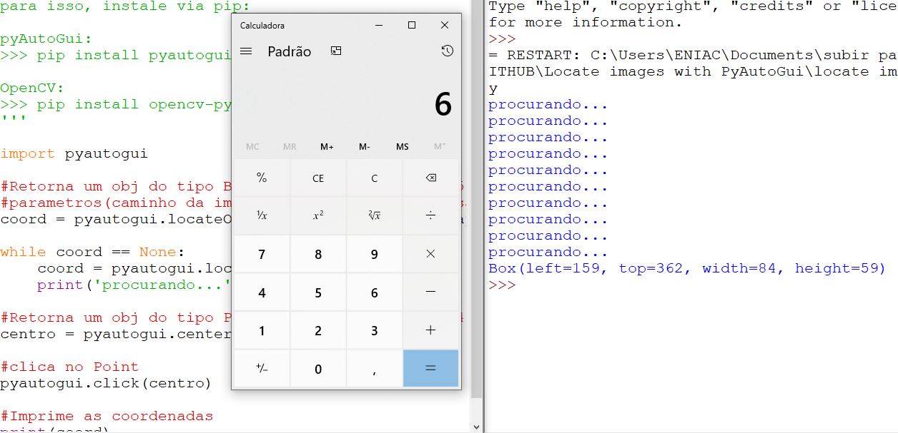

# Locate images with PyAutoGui
> Search the screen for the image sent as a parameter and when located click on the center of the image.


Este repositório, juntamente com o de webscraping, serviram de base para a criação do código para _resolver captcha com imagens_ demonstrado em aula. Lembrando que o conteúdo aqui é utilizado apenas para fins didáticos.


.


## Requisitos

pyAutoGui:

```sh
pip install pyautogui
```

OpenCV:

```sh
pip install opencv-python
```


